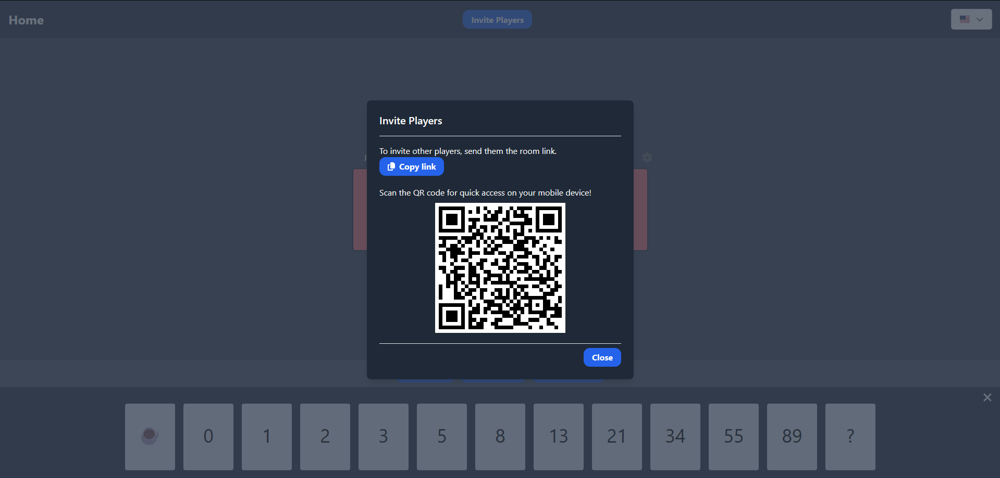
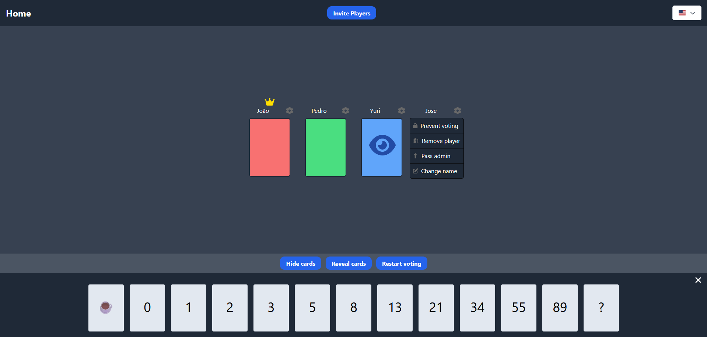

# Scrum Poker

Scrum Poker is a tool used to facilitate story point estimation within a Scrum team.

production: <https://scrum-poker-three.vercel.app/>

_Read this in other languages: [Portugues-BR](README.pt.md)_

## Table of Contents

- [Scrum Poker](#scrum-poker)
  - [Table of Contents](#table-of-contents)
  - [About](#about)
  - [Features](#features)
  - [Installation](#installation)
  - [Usage](#usage)
    - [Creating a room](#creating-a-room)
    - [Imagens](#imagens)
      - [Modal to Invite Players (QR Code and Link)](#modal-to-invite-players-qr-code-and-link)
      - [Room View](#room-view)
      - [Reveal Votes](#reveal-votes)
    - [Admin permissions](#admin-permissions)
  - [Technologies Used](#technologies-used)
  - [Contributing](#contributing)

## About

Scrum Poker is a planning tool used by agile development teams to estimate the relative effort of user stories during a sprint. The app allows players to participate in a poker session and choose cards to collaboratively estimate effort.

**PROJECT STATUS**: Improvement Phase.

## Features

- Room creation for Scrum Poker sessions
- Voting on planning cards by each player
- Admin control for room moderation
- Support for multiple players in real-time (via WebSocket)
- Multi-language support (i18n - Portuguese and English)
- Modals for user interactions (changing name and choice)
- Good layout to mobile

## Installation

1. Clone the Frontend repository:

```bash
git clone https://github.com/wallacy-1/scrum-poker.git
cd scrum-poker
```

2. Install the Frontend dependencies:

```bash
npm install
```

3. Start the Frontend project:

```bash
npm start
```

4. Clone the Backend repository (Socket for Scrum Poker):

```bash
git clone https://github.com/wallacy-1/jogos-sockets.git
cd jogos-sockets
```

5. Install the dependencies and start the Backend:

```bash
npm install

npm run start:dev
```

## Usage

### Creating a room

1. Join a video call with your team or be in a room.
2. On the main page, create a room.
3. Share the room link with the players.
4. Choose a card and wait for other players to vote.
5. Reveal the cards and discuss with your team.
6. Take the average and use it as the story point/weight.

### Imagens

#### Modal to Invite Players (QR Code and Link)



#### Room View



- "João" has not voted yet (**red card**)
- "Pedro" has voted (**green card**)
- "Yuri" cannot vote; he is an observer (**blue card** with an eye icon)
- "Jose" shows **admin** actions on the **gear icon**

#### Reveal Votes


- "Bia" did not vote, so it shows "N/A"
- **The admin can change the score, but a warning will remain on the card**

### Admin permissions

- Change players' cards
- Change players' names
- Remove players from the room
- Reset votes
- Disable voting for specific players

## Technologies Used

- React: A library for building user interfaces.
- React Router: Route management for the project.
- Tailwind CSS: A utility-first CSS framework for styling.
- Socket IO: Real-time communication between players.
- i18n: Multi-language support for the application.

## Contributing

Contributions are welcome! Feel free to open issues or submit pull requests.
