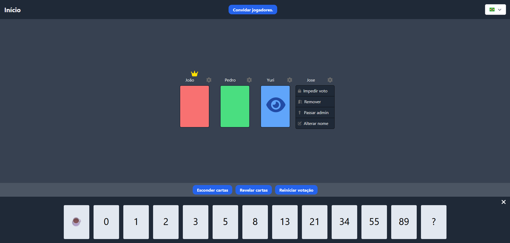

# Scrum Poker

Scrum Poker é utilizado para facilitar a definição de pontos/peso de histórias dentro de um time Scrum.

production: <https://scrum-poker-three.vercel.app/>

_Ler em outros idiomas: [Inglês](README.md)_

## Índice

- [Scrum Poker](#scrum-poker)
  - [Índice](#índice)
  - [Sobre](#sobre)
  - [Funcionalidades](#funcionalidades)
  - [Instalação](#instalação)
  - [Uso](#uso)
    - [Criação de uma sala](#criação-de-uma-sala)
    - [Imagens](#imagens)
      - [Modal para convidar jogadores (QR Code e link)](#modal-para-convidar-jogadores-qr-code-e-link)
      - [Visual da sala](#visual-da-sala)
      - [Revelar votos](#revelar-votos)
    - [Permissões do administrador](#permissões-do-administrador)
  - [Tecnologias Utilizadas](#tecnologias-utilizadas)
  - [Contribuição](#contribuição)

## Sobre

O Scrum Poker é uma ferramenta de planejamento utilizada por equipes de desenvolvimento ágil para estimar o esforço relativo de histórias de usuários em uma sprint. A aplicação permite que os jogadores participem de uma sessão de poker e escolham cartas para estimar o esforço de forma colaborativa.

## Funcionalidades

- Criação de salas para Scrum Poker
- Votação em cartas de planejamento por cada jogador
- Administração de permissões para o moderador da sala
- Suporte a múltiplos jogadores em tempo real (via WebSocket)
- Suporte aos idiomas Portugues-BR e ingles (i18n)

## Instalação

1. Clone o repositório do Frontend:

```bash
git clone https://github.com/wallacy-1/scrum-poker.git
cd scrum-poker
```

2. Instale as dependências do Frontend:

```bash
npm install
```

3. Inicie o projeto do frontend:

```bash
npm start
```

4. Clone o repositório do Backend (Socket do Scrum Poker):

```bash
git clone https://github.com/wallacy-1/jogos-sockets.git
cd jogos-sockets
```

5. Instale as dependências e inicie o Backend:

```bash
npm install

npm run start:dev
```

## Uso

### Criação de uma sala

1. Entre em uma chamada de video com a sua equipe (opcional).
2. Na página principal, Crie uma sala.
3. Compartilhe o link da sala com os jogadores.
4. Escolha uma carta e espere os outros jogadores votarem.
5. Mostre as cartas e discuta com a sua equipe.
6. Use a média como o ponto/peso da história.

### Imagens

#### Modal para convidar jogadores (QR Code e link)


#### Visual da sala



- "João" ainda não votou (**cartão vermelho**)
- "Pedro" votou (**cartão verde**)
- "yuri" não pode votar, ele é um observador (**cartão azul** com - ícone de olho)
- "Jose" mostra ações do **admin** no **ícone de engrenagem**

#### Revelar votos


- "bia" não votou por isso ficou "N/D"
- **O admin pode alterar a nota mas ficara um aviso no card**

### Permissões do administrador

- Alterar a carta dos jogadores
- Mudar o nome dos jogadores
- Remover jogador da sala
- Reiniciar votos
- Revelar cartas
- Impedir voto de algum jogador

## Tecnologias Utilizadas

- React: Biblioteca para criação de interfaces.
- React Router: Gerenciamento de rotas no projeto.
- Tailwind CSS: Framework CSS para estilização.
- Socket IO: Comunicação em tempo real entre os jogadores.
- i18n: Suporte para múltiplos idiomas.

## Contribuição

Contribuições são bem-vindas! Sinta-se à vontade para abrir issues ou enviar pull requests.
